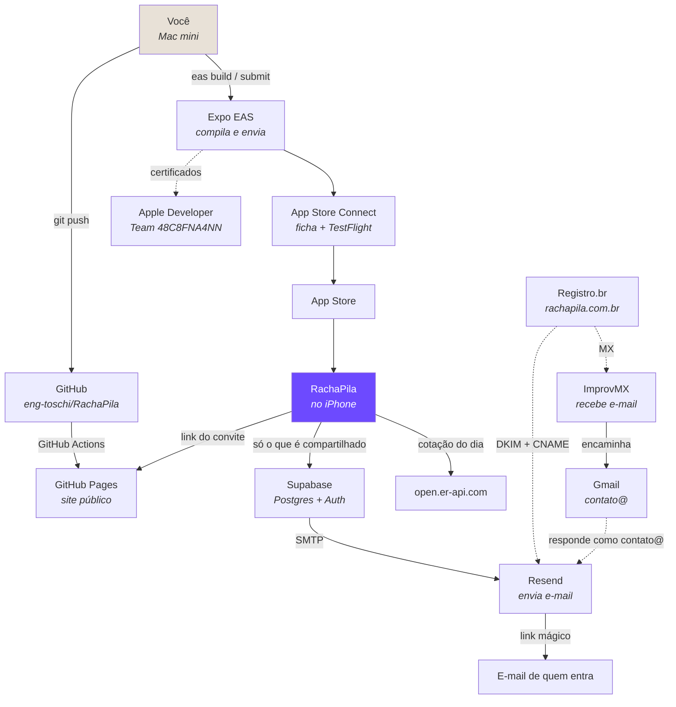
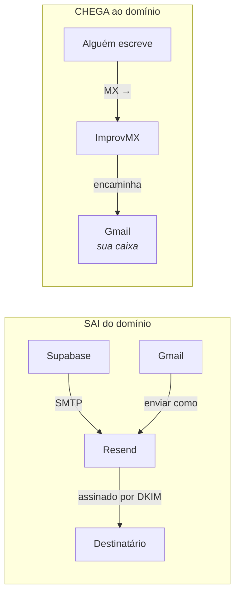
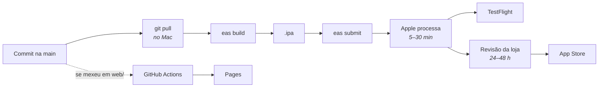
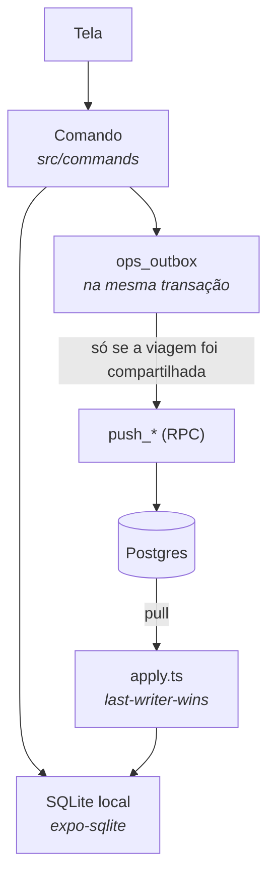

# Infraestrutura: quem é quem, e por que existe

Onze serviços de terceiros para um app que divide a conta do jantar parece
exagero — e seria, se cada um não estivesse resolvendo um problema que os
outros não resolvem. Este documento existe para que, daqui a seis meses,
ninguém precise reconstruir por dedução o motivo de cada um estar ali.

A regra que orientou as escolhas: **nenhum serviço pago enquanto um gratuito
resolver**, e **nenhum serviço no caminho crítico do app funcionar**. O
RachaPila roda inteiro sem rede e sem conta; tudo abaixo serve para
compartilhar viagem, publicar o app ou receber e-mail.

---

## O mapa

Linha cheia é caminho de dados; tracejada é configuração ou credencial.

---

## Cada um, e o que foi configurado

### GitHub — `eng-toschi/RachaPila` (público)

Guarda o código e, de quebra, **hospeda o site**. Repositório público foi
escolha deliberada: é o que torna o GitHub Pages gratuito e dispensou a
Cloudflare.

- `.github/workflows/pages.yml` publica a pasta `web/` a cada mudança nela,
  com `enablement: true` para ligar o Pages sozinho na primeira execução.
- Settings → Pages → Source: **GitHub Actions**.

**Por que não uma branch `gh-pages`:** uma das páginas é a política de
privacidade, documento que a Apple e a LGPD cobram. Duas cópias de um texto
desses saem de sincronia mais cedo ou mais tarde.

### GitHub Pages — `eng-toschi.github.io/RachaPila`

Três páginas estáticas que resolvem exigências diferentes:

| Página | Para quê |
|---|---|
| `index.html` | URL de suporte da ficha (campo obrigatório) |
| `privacidade.html` | URL de privacidade (obrigatória; LGPD) |
| `convite.html?c=<token>` | **abre o app pelo convite, ou leva à loja quem não tem** |

A terceira é a que faz o convite funcionar fora do grupo de quem já
instalou. Sem ela, o convite era um código para colar num app inexistente.

### Expo / EAS — projeto `@fernando.toschi/rachapila`

Compila iOS e Android na nuvem e envia para as lojas. Dispensa ter Xcode e
Android Studio na máquina.

- `eas.json`: perfis `development`, `preview` (APK), `production`,
  `simulator` (para capturas de tela no tamanho da loja).
- `appVersionSource: "remote"` + `autoIncrement`: o servidor controla o
  número do build, causa comum de envio recusado.
- `submit.production.ios`: `appleTeamId` e `ascAppId` fixados — com dois
  times no mesmo Apple ID, menu interativo é convite a errar.
- Guarda as credenciais: keystore Android, certificado iOS, chave da API do
  App Store Connect.

**Expo Go** é só para desenvolvimento. Ele não é dono do esquema
`rachapila://` nem guarda sessão entre reinícios do servidor — o link mágico
e o deep link só funcionam de verdade num build próprio.

### Apple Developer — Team `48C8FNA4NN` (Individual)

A inscrição que permite assinar e distribuir. Conta pessoal
(`eng.toschi@icloud.com`), que também é Admin do time de um cliente — daí a
atenção constante ao seletor de time.

- Bundle ID `app.rachapila.mobile`, registrado pela EAS no primeiro build.

### App Store Connect — app `6814317296`

Onde o app existe como produto: ficha, privacidade, preço, TestFlight,
revisão. **Site diferente do developer.apple.com**, o que confunde na
primeira vez.

- Rótulos de privacidade: cinco tipos de dado, todos só para funcionalidade
  do app, todos vinculados à identidade, **nenhum** para rastreamento.
- TestFlight: grupo externo, com "início de sessão obrigatório" **desmarcado**
  — o app funciona sem conta e não tem senha.

### Supabase — `wqoubxpidrfnitttkqej.supabase.co`

Postgres, autenticação e as regras de acesso. **Só recebe dados de viagem
compartilhada**: viagem que nunca foi compartilhada nunca sai do aparelho.

- Nove tabelas: `trips`, `trip_currencies`, `trip_members`, `participants`,
  `trip_invites`, `expenses`, `expense_shares`, `settlements`,
  `trip_subgroups`.
- Sete funções: `is_trip_member`, `accept_trip_invite`, `push_trip`,
  `push_participant`, `push_expense`, `push_settlement`, `delete_my_account`.
- RLS em tudo, mais três políticas de *bootstrap* para o caso da primeira
  viagem, que não tem dono ainda.
- Auth: link mágico com PKCE, sem senha. Redirect URLs `exp://**` (Expo Go) e
  **`rachapila://**`** (build de verdade) — faltar o segundo joga o usuário no
  `localhost:3000`.
- SMTP próprio apontando para o Resend, porque o SMTP embutido tem limite
  baixíssimo.

### Resend — envio de e-mail

O único caminho de **saída** de e-mail. Dois usos, com chaves separadas:

| Uso | Chave | Por quê separadas |
|---|---|---|
| Link mágico (via Supabase) | `RachaPila` | revogar uma não pode derrubar a outra — e a do link é a crítica |
| "Enviar como" do Gmail | `gmail-send-as` | |

O domínio é autenticado por **DKIM**; não há SPF na raiz, e o DMARC está em
`p=none`.

### Registro.br — `rachapila.com.br`

O domínio e sua zona DNS. Quatro grupos de registro, de três donos
diferentes:

| Registro | De quem | Para quê |
|---|---|---|
| TXT `resend._domainkey` | Resend | DKIM: autentica o e-mail que sai |
| CNAME `send`, `rsend` | Resend | envelope de retorno e rastreio |
| TXT `_dmarc` | — | política `p=none` (só observa) |
| MX `mx1`/`mx2.improvmx.com` | ImprovMX | recebe o e-mail que chega |

**A armadilha:** o ImprovMX sugere um TXT com `v=spf1 include:spf.improvmx.com`.
**Não se adiciona.** SPF é regra de envio e não tem função no encaminhamento
de entrada; esse valor declararia que só o ImprovMX pode enviar pelo domínio,
e o que quebraria é a entrega do link mágico.

### ImprovMX — recepção de `contato@`

Encaminha `contato@rachapila.com.br` para o Gmail pessoal. Escolhido por
tocar **apenas nos registros MX**, deixando intocados o DKIM e os CNAME que o
Resend validou.

A alternativa pelo iCloud+ obrigaria a mesclar SPF, com risco para o link
mágico.

### Gmail — a caixa de verdade

Lê o que chega e **responde como `contato@`**, via SMTP do Resend. Foi o
critério que decidiu Gmail e não iCloud: só ele envia por um endereço externo
com SMTP próprio.

- "Enviar e-mail como" → `smtp.resend.com`, porta 587, TLS.
- "Responder pelo mesmo endereço em que a mensagem foi recebida" — sem isso,
  a resposta sai do endereço pessoal, que é o que se queria evitar.
- O pessoal continua sendo o padrão para o que se escreve do zero.

### open.er-api.com — cotações

API pública, sem chave, para a cotação do dia de cada gasto. A resposta é
tratada como **dado não confiável**: conferida campo a campo antes de virar
taxa, e na dúvida o app cai no preenchimento manual.

Nunca está no caminho crítico — sem rede, digita-se a cotação.

### Cloudflare — avaliada e descartada

Chegou a haver conta. O painel move o Pages para dentro de "Compute", e o
caminho do DNS exigiria trocar os servidores de nome, mexendo no que o Resend
já validou. Com o repositório público, o GitHub Pages fez o mesmo sem conta
nova e sem tocar no DNS.

Fica registrado para ninguém refazer o mesmo caminho.

---

## O caminho do e-mail

É onde mais gente se perde, porque **enviar e receber não têm nada em comum**.

O Resend **não tem caixa postal** — era o que faltava entender. Foi preciso
o ImprovMX para a outra direção.

## O caminho do código até a loja

O `git pull` está no desenho de propósito: a EAS empacota o que está **na sua
máquina**, não o que está no GitHub. Esquecê-lo já custou um ciclo inteiro.

## O caminho dos dados da viagem

A fila de operações é gravada **na mesma transação** do dado. É isso que faz
o app não perder lançamento feito sem rede, e é a razão de existir a coluna
`lamport` em cada linha: quando dois celulares editam o mesmo gasto offline,
o desempate é determinístico e dá o mesmo resultado nos dois.

---

## O que isto custa

| Serviço | Hoje |
|---|---|
| Apple Developer | US$ 99/ano |
| GitHub, GitHub Pages | grátis (repositório público) |
| Expo EAS | grátis (fila compartilhada) |
| Supabase | grátis (projeto pequeno) |
| Resend | grátis (até 100 e-mails/dia) |
| ImprovMX | grátis |
| Registro.br | ~R$ 40/ano |
| open.er-api.com | grátis, sem chave |

**Custo fixo: US$ 99 + o domínio.** Todo o resto está em plano gratuito, e
nenhum deles é obrigatório para o app funcionar no aparelho de quem baixou.
